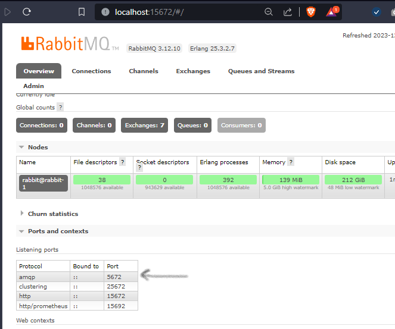

# go-rabbitmq

# step.1 - run container
- create a new network so all instances can talk to each other
```shell
make rabbit-network
```
- spin rabbitmq docker container 
```shell
make rabbit-instance
```
- if we explored the container 
```shell
➜ go-rabbitmq git:(main) docker container ps
CONTAINER ID   IMAGE                  COMMAND                  CREATED          STATUS          PORTS                                                 NAMES
abbfe94ed74a   rabbitmq               "docker-entrypoint.s…"   18 minutes ago   Up 17 minutes   4369/tcp, 5671-5672/tcp, 15691-15692/tcp, 25672/tcp   rabbit-1
```
notice that :
 * if we run inside a cluster, the port is the 4369/tcp 
 * if we have another application needs to communicate to the queue and consume it, the port is 5671-5672/tcp

# step.2 - enable management ui
- open bash inside the container by running 
```shell
make rabbit-bash
```
- then run this command via the rabbitmq-plugin cli 
```bash
rabbitmq-plugins enable rabbitmq_management
```
- make a http request on the browser to `localhost:15672` <br>
- the port that I am pointing to is the port that we will use for the application that publishs msgs to the queue 
 

# Theory 
- Channel is a vritual connection to a specific queue 

# Authentication between cluster nodes 
once the container is running, execute the following <br>
```bash
docker exec -it $(host_name) cat /var/lib/rabbitmq/.erlang.cookie
```
and this will print the cookie for you so we can use it in our rabbitmq instances to talk to each others <br>

- in order to form a cluster, we have to reset the node before joining the cluster 
- so i will join all the nodes in node-1's cluster using the following commands <br>
```bash
    # stop_app will stop the process but keep container running 
	docker exec -it rabbit-node-2 rabbitmqctl stop_app
    # reset all data
	docker exec -it rabbit-node-2 rabbitmqctl reset
    # join the node1 cluster
	docker exec -it rabbit-node-2 rabbitmqctl join_cluster rabbit@rabbit-1
    # start the process again 
	docker exec -it rabbit-node-2 rabbitmqctl start_app
    # print new cluster info 
	docker exec -it rabbit-node-2 rabbitmqctl cluster_status
```